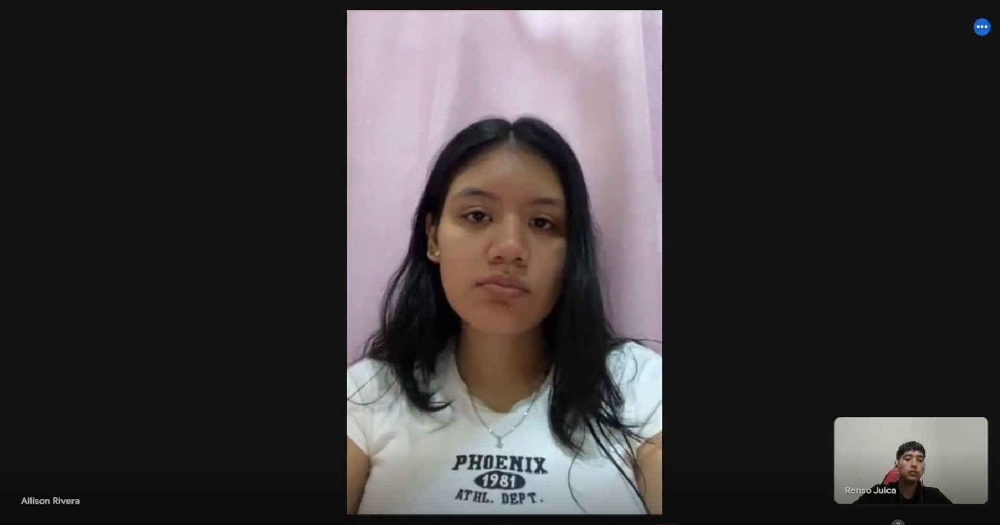

# Informe del Trabajo Final

**Universidad Peruana de Ciencias Aplicadas**

**Ingeniería de software**

**1ASI0730 Aplicaciones Web**

**Sección:** 4363

**Profesor:** Sánchez Ponce, Alex Humberto

**Nombre del StartUp:** PaxTech

**Nombre del Producto:** uTime

| Nombre                              | Código     |
|-------------------------------------|------------|
| Falcon Hilarion, Fred Wilber        | U202422331 |
| Julca Cruz, Renso Anthony           | U202121579 |
| Rivera Sosa, Eduardo Gael           | U202312222 |
| Varela Bustinza, Marcelo Alessandro | U202319668 |
| Yalán Zhang, Angie Christina        | U202312504 |

**Ciclo 2025-01**

# Registro de Versiones del Informe

| Version | Fecha      | Autor                                   | Descripción de modificación                          |
| ------- |------------|-----------------------------------------| ------------------------------------------------------ |
| 1.0     | 05/04/2025 | Falcon, Julca, Rivera, Varela, Yalán    | Creación del documento de trabajo en formato markdown |
| 1.1     |            | Falcon, Julca, Rivera, Varela, Yalán    |                                                        |
| 1.2     |            | Falcon, Julca, Rivera, Varela, Yalán    |                                                        |
| 1.3     |            | Falcon, Julca, Rivera, Varela, Yalán    |                                                        |
| 1.4     |            | Falcon, Julca, Rivera, Varela, Yalán    |                                                        |
| 1.5     |            | Falcon, Julca, Rivera, Varela, Yalán    |                                                        |
| 1.6     |            | Falcon, Julca, Rivera, Varela, Yalán    |                                                        |
| 1.7     |            | Falcon, Julca, Rivera, Varela, Yalán    |                                                        |
| 1.8     |            | Falcon, Julca, Rivera, Varela, Yalán    |                                                        |

# Project Report Collaboration Insights

URL del repositorio para el proyecto: https://github.com/UPC-PaxTech/uTime/

**TB1**

Para el desarrollo del informe perteneciente a la entrega TB1, se dividió la implementación de secciones de la siguiente forma
para cada integrante del equipo:

| Integrantes    | Tareas Asignadas |
|----------------| ---------------- |
| Fred Falcon    |                  |
| Renso Julca    |                  |
| Gael Rivera    |                  |
| Marcelo Varela |                  |
| Angie Yalán    |                  |

**Github Collaboration Insights**

Github también presenta un timeline de las ramas principales y los procesos de merge a los que se han sometido. Todas las
ramas se crearon tomando en cuenta el diseño de GitFlow para una buena organización cuando se usa un software de control
de versiones.

Los integrantes son:

- Fred Falcon (barry-91)
- Renso Julca (rajc02)
- Gael Rivera (gael-rs)
- Marcelo Varela (VarBus)
- Angie Yalán (aaaaangie)

Se explican las ramas más prominentes:

**main:** Es la rama principal del proyecto, donde se almacenan los distintos entregables. Se actualiza para cada entrega oficial del proyecto. 

**develop:** Es la rama principal para el proceso de desarrollo del proyecto. En ella se integran las funcionalidades completadas antes de ser fusionadas a la rama main. 

**feature/Nombre-del-integrante:** Es una rama creada por cada miembro del equipo para trabajar en una nueva funcionalidad o tarea específica. Se basa en develop y, una vez terminada la tarea, se fusiona nuevamente con develop para integrar los cambios al proyecto principal. 

# Contenido

1. [Capítulo I: Introducción](#capítulo-i-introducción) 
   1.1. [Startup Profile](#11-startup-profile) 
   1.1.1. [Descripción de la Startup](#111-descripción-de-la-startup) 
   1.1.2. [Perfiles de integrantes del equipo](#112-perfiles-de-integrantes-del-equipo) 
   1.2. [Solution Profile](#12-solution-profile) 
   1.2.1 [Antecedentes y problemática](#121-antecedentes-y-problemática) 
   1.2.2 [Lean UX Process](#122-lean-ux-process) 
   1.2.2.1. [Lean UX Problem Statements](#1221-lean-ux-problem-statements) 
   1.2.2.2. [Lean UX Assumptions](#1222-lean-ux-assumptions) 
   1.2.2.3. [Lean UX Hypothesis Statements](#1223-lean-ux-hypothesis-statements) 
   1.2.2.4. [Lean UX Canvas](#1224-lean-ux-canvas) 
   1.3. [Segmentos objetivo](#13-segmentos-objetivo) 
2. [Capítulo II: Requirements Elicitation & Analysis](#capítulo-ii-requirements-elicitation--analysis) 
   2.1. [Competidores](#21-competidores) 
   2.1.1. [Análisis competitivo](#211-análisis-competitivo) 
   2.1.2. [Estrategias y tácticas frente a competidores](#212-estrategias-y-tácticas-frente-a-competidores) 
   2.2. [Entrevistas](#22-entrevistas) 
   2.2.1. [Diseño de entrevistas](#221-diseño-de-entrevistas) 
   2.2.2. [Registro de entrevistas](#222-registro-de-entrevistas) 
   2.2.3. [Análisis de entrevistas](#223-análisis-de-entrevistas) 
   2.3. [Needfinding](#23-needfinding) 
   2.3.1. [User Personas](#231-user-personas) 
   2.3.2. [User Task Matrix](#232-user-task-matrix) 
   2.3.3. [User Journey Mapping](#232-user-task-matrix) 
   2.3.4. [Empathy Mapping](#234-empathy-mapping) 
   2.3.5. [As-is Scenario Mapping](#235-as-is-scenario-mapping) 
   2.4. [Ubiquitous Language](#24-ubiquitous-language) 
3. [Capítulo III: Requirements Specification](#capítulo-iii-requirements-specification) 
   3.1. [To-Be Scenario Mapping](#31-to-be-scenario-mapping) 
   3.2. [User Stories](#32-user-stories) 
   3.3. [Impact Mapping](#33-impact-mapping) 
   3.4. [Product Backlog](#34-product-backlog) 
4. [Capítulo IV: Product Design](#capítulo-iv-product-design) 
   4.1. [Style Guidelines](#41-style-guidelines) 
   4.1.1. [General Style Guidelines](#411-general-style-guidelines) 
   4.1.2. [Web Style Guidelines](#412-web-style-guidelines) 
   4.2. [Information Architecture](#42-information-architecture) 
   4.2.1. [Organization Systems](#421-organization-systems) 
   4.2.2. [Labeling Systems](#422-labeling-systems) 
   4.2.3. [SEO Tags and Meta Tags](#423-seo-tags-and-meta-tags) 
   4.2.4. [Searching Systems](#424-searching-systems) 
   4.2.5. [Navigation Systems](#425-navigation-systems) 
   4.3. [Landing Page UI Design](#43-landing-page-ui-design) 
   4.3.1. [Landing Page Wireframe](#431-landing-page-wireframe) 
   4.3.2. [Landing Page Mock-up](#432-landing-page-mock-up) 
   4.4. [Web Applications UX/UI Design](#44-web-applications-uxui-design) 
   4.4.1. [Web Applications Wireframes](#441-web-applications-wireframes) 
   4.4.2. [Web Applications Wireflow Diagrams](#442-web-applications-wireflow-diagrams) 
   4.4.2. [Web Applications Mock-ups](#442-web-applications-mock-ups) 
   4.4.3. [Web Applications User Flow Diagrams](#443-web-applications-user-flow-diagrams) 
   4.5. [Web Applications Prototyping](#45-web-applications-prototyping) 
   4.6. [Domain-Driven Software Architecture](#46-domain-driven-software-architecture) 
   4.6.1. [Software Architecture Context Diagram](#461-software-architecture-context-diagram) 
   4.6.2. [Software Architecture Container Diagrams](#462-software-architecture-container-diagrams) 
   4.6.3. [Software Architecture Components Diagrams](#463-software-architecture-components-diagrams) 
   4.7. [Software Object-Oriented Design](#47-software-object-oriented-design) 
   4.7.1. [Class Diagrams](#471-class-diagrams) 
   4.7.2. [Class Dictionary](#472-class-dictionary) 
   4.8. [Database Design](#48-database-design) 
   4.8.1. [Database Diagram](#481-database-diagram) 
5. [Capítulo V: Product Implementation, Validation & Deployment](#capítulo-v-product-implementation-validation--deployment) 
   5.1. [Software Configuration Management](#51-software-configuration-management) 
   5.1.1. [Software Development Environment Configuration](#511-software-development-environment-configuration) 
   5.1.2. [Source Code Management](#512-source-code-management) 
   5.1.3. [Source Code Style Guide & Conventions](#513-source-code-style-guide--conventions) 
   5.1.4. [Software Deployment Configuration](#514-software-deployment-configuration) 
   5.2. [Landing Page, Services & Applications Implementation](#52-landing-page-services--applications-implementation) 
   5.2.1. [Sprint 1](#521-sprint-1) 
   5.2.1.1. [Sprint Planning 1](#5211-sprint-planning-1) 
   5.2.1.2. [Aspect Leaders and Collaborators](#5212-aspect-leaders-and-collaborators) 
   5.2.1.3. [Sprint Backlog 1](#5213-sprint-backlog-1) 
   5.2.1.4. [Development Evidence for Sprint Review](#5214-development-evidence-for-sprint-review) 
   5.2.1.5. [Execution Evidence for Sprint Review](#5215-execution-evidence-for-sprint-review) 
   5.2.1.6. [Services Documentation Evidence for Sprint Review](#5216-services-documentation-evidence-for-sprint-review) 
   5.2.1.7. [Software Deployment Evidence for Sprint Review](#5217-software-deployment-evidence-for-sprint-review) 
   5.2.1.8. [Team Collaboration Insights during Sprint](#5218-team-collaboration-insights-during-sprint) 

6. [Conclusiones](#conclusiones) 
   6.1 [Conclusiones y recomendaciones](#61-conclusiones-y-recomendaciones) 
7. [Bibliografía](#bibliografía) 
8. [Anexos](#anexos) 

# Student Outcomes

**Student Outcome 3**

| Criterio específico                                                | Acciones realizadas                                                                      | Conclusiones |
|--------------------------------------------------------------------|------------------------------------------------------------------------------------------|------|
| Comunica oralmente con efectividad a diferentes rangos de audiencia. | Fred Falcon:  Renso Julca:  Gael Rivera:  Marcelo Varela:  Angie Talán:   |      |
| Comunica por escrito con efectividad a diferentes rangos de audiencia | Fred Falcon:  Renso Julca:  Gael Rivera:  Marcelo Varela:  Angie Talán:       |      |

# Capítulo I: Introducción

## 1.1. Startup Profile

### 1.1.1. Descripción de la Startup

### 1.1.2. Perfiles de integrantes del equipo

| **Perfil**                                                                                                                                                                                                                                                                                                                                                                                                                                                                                                                               | **Foto**                                                                      |
|------------------------------------------------------------------------------------------------------------------------------------------------------------------------------------------------------------------------------------------------------------------------------------------------------------------------------------------------------------------------------------------------------------------------------------------------------------------------------------------------------------------------------------------|-------------------------------------------------------------------------------|
| **Falcon Hilarion, Fred Wilber**  *Descripción breve*                                                                                                                                                                                                                                                                                                                                                                                                                                                                                 |                                                   |
| **Julca Cruz, Renso Anthony**  *Descripción breve*                                                                                                                                                                                                                                                                                                                                                                                                                                                                                    |                                                  |
| **Rivera Sosa, Eduardo Gael** Yo soy Gael Rivera. Soy un estudiante de Ingeniería de Software comprometido con la responsabilidad en cada tarea que asumo. Poseo habilidades de liderazgo que facilitan la comunicación y el trabajo colaborativo. Siempre estoy dispuesto a abordar desafíos y encontrar soluciones en equipo.                                                                                                                                                                                                       |   |
| **Varela Bustinza, Marcelo Alessandro** Mi nombre es Marcelo Varela. Soy un estudiante de la carrera de Ingeniería De Software, tengo 20 años y actualmente me encuentro cursando el quinto ciclo de la carrera. Me caracterizo por ser una persona responsable, resiliente y proactiva, al cual le gusta aprender sobre tecnología y el desarrollo de software. Mi compromiso como miembro de este equipo es brindar mi apoyo y participación para enfrentar lo desafíos así como dar lo mejor de mí para el éxito de este proyecto. | |
| **Yalán Zhang, Angie Christina** Mi nombre es Angie Yalán. Soy estudiante de la carrera Ingeniería de Software y tengo 19 años. Me considero una persona proactiva que le gustan nuevas experiencias y aprender cosas diferentes. Sigo en el proceso de mejora en cuanto a la programación y cuento con toda la iniciativa para ser cada día mejor en ello.                                                                                                                                                                           |                                                       |

## 1.2. Solution Profile

### 1.2.1 Antecedentes y problemática

### 1.2.2 Lean UX Process

#### 1.2.2.1. Lean UX Problem Statements

#### 1.2.2.2. Lean UX Assumptions

##### 1.2.2.2.2. Business Outcomes

##### 1.2.2.2.3. User Benefits

#### 1.2.2.3. Lean UX Hypothesis Statements.

#### 1.2.2.4. Lean UX Canvas.

## 1.3. Segmentos objetivo.

# Capítulo II: Requirements Elicitation & Analysis

## 2.1. Competidores.

### 2.1.1. Análisis competitivo.

### 2.1.2. Estrategias y tácticas frente a competidores

## 2.2. Entrevistas.

### 2.2.1. Diseño de entrevistas.

### Preguntas para el Segmento Objetivo 01 (Dueños de salones de belleza o barberías)

1. ¿Cuánto tiempo lleva en el rubro de la belleza/barbería y qué lo motivó a dedicarse a este negocio?
2. ¿Cómo suelen agendar las citas sus clientes y qué método prefieren ellos? (WhatsApp, llamadas, redes sociales, otros).
3. ¿Cuán flexible es su agenda diaria y qué tan difícil es manejar cambios de última hora en las reservas?
4. ¿Usan algún sistema o aplicación para gestionar reservas y pagos? Si no, ¿cómo lo hacen actualmente?
5. ¿Cuáles son los principales canales de comunicación que usan para confirmar o recordar citas?
6. ¿Cuáles son los principales desafíos que enfrenta al gestionar las reservas y la relación con los clientes?
7. ¿Con qué frecuencia enfrentan cancelaciones o clientes que no se presentan? ¿Cómo manejan estas situaciones?
8. ¿Qué estrategias usan para que los clientes regresen a su negocio y qué tan efectivas han sido?
9. ¿Qué tan abiertos están a implementar nuevas herramientas digitales que les ayuden a organizar mejor su negocio?
10. ¿Qué mejoras le gustaría implementar en su negocio en el corto y mediano plazo?

### Preguntas para el Segmento Objetivo 02 (Clientes de salones de belleza o barberías)

1. ¿Con qué frecuencia visitas un salón de belleza o barbería y qué servicios sueles solicitar?
2. ¿Qué factores consideras más importantes al elegir un salón de belleza o barbería? (Ubicación, precio, reputación, servicio, etc.)
3. ¿Sueles atenderte con el mismo estilista/barbero? ¿Por qué?
4. ¿Cómo prefieres agendar tus citas? (WhatsApp, llamadas, página web, aplicación, presencialmente).
5. ¿Qué tan importante es para ti que te atiendan a la hora exacta de tu cita? ¿Has tenido experiencias negativas con largas esperas?
6. Si necesitas cancelar o reprogramar tu cita, ¿qué tan fácil o difícil suele ser el proceso?
7. ¿Qué métodos de pago prefieres al momento de pagar por el servicio? (Efectivo, tarjeta, transferencias, apps de pago).
8. ¿Cómo te gusta recibir recordatorios de tu cita o promociones? (Mensajes de WhatsApp, correos, redes sociales, llamadas).
9. ¿Has utilizado alguna aplicación o plataforma para reservar citas en salones de belleza/barberías? ¿Cómo fue tu experiencia?
10. ¿Qué aspecto te gustaría que mejoraran los salones de belleza/barberías para una mejor experiencia como cliente?

### 2.2.2. Registro de entrevistas.

#### Datos del Entrevistado #1

- **Nombre completo:** Allison Milagros Rivera Quispe
- **Segmento Objetivo:** Clientes de servicio de belleza
- **Edad:** 20 años
- **Distrito:** San Martín de Porres
- **Screenshot del cuadro de video:** **
- **URL del video (Microsoft Stream):**  *[Entrevista 01](https://upcedupe-my.sharepoint.com/:v:/g/personal/u202121579_upc_edu_pe/EeoQkyackMpHjzBXjZNIML0Bu8Bmb_quTgE2bXnkrwnptA?nav=eyJyZWZlcnJhbEluZm8iOnsicmVmZXJyYWxBcHAiOiJTdHJlYW1XZWJBcHAiLCJyZWZlcnJhbFZpZXciOiJTaGFyZURpYWxvZy1MaW5rIiwicmVmZXJyYWxBcHBQbGF0Zm9ybSI6IldlYiIsInJlZmVycmFsTW9kZSI6InZpZXcifX0%3D&e=hgJtIF)*
- **Inicio de la entrevista:** 00:20 minutos
- **Duración:** 3:59 minutos

Allison Rivera, de 20 años, es una joven universitaria que visita salones de belleza aproximadamente una vez al mes. Sus servicios más frecuentes son la manicura, el corte de cabello y tratamientos capilares. Su personalidad se refleja en una actitud práctica y confiada: valora la calidad del servicio y la reputación del salón por encima de otros factores como el precio o la ubicación.

Prefiere atenderse siempre con el mismo estilista, ya que confía en esa persona y se siente segura con los resultados que obtiene. La puntualidad es un aspecto crítico para ella, ya que busca que el servicio no interfiera con otras actividades de su día, aunque menciona que nunca ha tenido experiencias negativas respecto a esperas.

Agenda sus citas por WhatsApp, canal que también prefiere para recibir recordatorios o promociones, junto con las redes sociales. A pesar de ser nativa digital, nunca ha utilizado una aplicación o plataforma especializada para reservas, aunque está abierta a esa posibilidad si mejorará la rapidez de respuesta al momento de agendar.

En cuanto a métodos de pago, Allison prefiere transferencias bancarias o apps de pago, evitando el uso de efectivo. También valora que los procesos de reprogramación de citas sean sencillos, experiencia que ha sido positiva para ella hasta ahora.

Finalmente, considera que una mejora importante para los salones de belleza sería acelerar el tiempo de respuesta al agendar citas vía WhatsApp, ya que a veces hay demoras que afectan su experiencia como cliente.

### 2.2.3. Análisis de entrevistas.

## 2.3. Needfinding.

### 2.3.1. User Personas.

### 2.3.2. User Task Matrix.

### 2.3.3. User Journey Mapping.

### 2.3.4. Empathy Mapping.

### 2.3.5. As-is Scenario Mapping.

## 2.4. Ubiquitous Language.

# Capítulo III: Requirements Specification

## 3.1. To-Be Scenario Mapping.

## 3.2. User Stories.

## 3.3. Impact Mapping.

## 3.4. Product Backlog.

# Capítulo IV: Product Design

## 4.1. Style Guidelines.

### 4.1.1. General Style Guidelines.

### 4.1.2. Web Style Guidelines.

## 4.2. Information Architecture.

### 4.2.1. Organization Systems.

### 4.2.2. Labeling Systems.

### 4.2.3. SEO Tags and Meta Tags

### 4.2.4. Searching Systems.

### 4.2.5. Navigation Systems.

## 4.3. Landing Page UI Design.

### 4.3.1. Landing Page Wireframe.

### 4.3.2. Landing Page Mock-up.

## 4.4. Web Applications UX/UI Design.

### 4.4.1. Web Applications Wireframes.

### 4.4.2. Web Applications Wireflow Diagrams.

### 4.4.2. Web Applications Mock-ups.

### 4.4.3. Web Applications User Flow Diagrams.

## 4.5. Web Applications Prototyping.

## 4.6. Domain-Driven Software Architecture.

### 4.6.1. Software Architecture Context Diagram.

### 4.6.2. Software Architecture Container Diagrams.

### 4.6.3. Software Architecture Components Diagrams.

### 4.7. Software Object-Oriented Design.

### 4.7.1. Class Diagrams.

### 4.7.2. Class Dictionary.

## 4.8. Database Design.

### 4.8.1. Database Diagram.

# Capítulo V: Product Implementation, Validation & Deployment

## 5.1. Software Configuration Management.

## 5.1.1. Software Development Environment Configuration.

### 5.1.2. Source Code Management.

### 5.1.3. Source Code Style Guide & Conventions.

### 5.1.4. Software Deployment Configuration.

## 5.2. Landing Page, Services & Applications Implementation.

### 5.2.1. Sprint 1

#### 5.2.1.1. Sprint Planning 1.

#### 5.2.1.2. Aspect Leaders and Collaborators.

#### 5.2.1.3. Sprint Backlog 1.

#### 5.2.1.4. Development Evidence for Sprint Review.

#### 5.2.1.5. Execution Evidence for Sprint Review.

#### 5.2.1.6. Services Documentation Evidence for Sprint Review.

#### 5.2.1.7. Software Deployment Evidence for Sprint Review.

#### 5.2.1.8. Team Collaboration Insights during Sprint.

# Conclusiones

## 6.1 Conclusiones y recomendaciones

# Bibliografía

# Anexos
