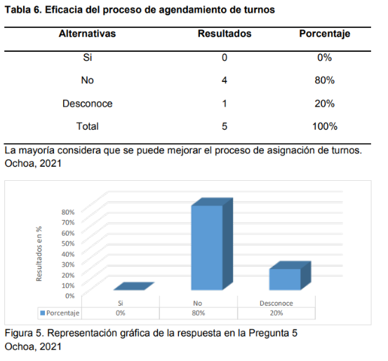
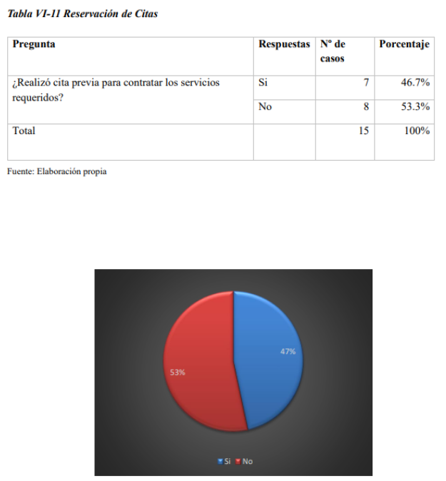

# Informe del Trabajo Final

**Universidad Peruana de Ciencias Aplicadas**

**Ingeniería de software**

**1ASI0730 Aplicaciones Web**

**Sección:** 4363

**Profesor:** Sánchez Ponce, Alex Humberto

**Nombre del StartUp:** PaxTech

**Nombre del Producto:** uTime

| Nombre                              | Código     |
|-------------------------------------|------------|
| Falcon Hilarion, Fred Wilber        | U202422331 |
| Julca Cruz, Renso Anthony           | U202121579 |
| Rivera Sosa, Eduardo Gael           | U202312222 |
| Varela Bustinza, Marcelo Alessandro | U202319668 |
| Yalán Zhang, Angie Christina        | U202312504 |

**Ciclo 2025-01**

# Registro de Versiones del Informe

| Version | Fecha      | Autor                                   | Descripción de modificación                          |
| ------- |------------|-----------------------------------------| ------------------------------------------------------ |
| 1.0     | 05/04/2025 | Falcon, Julca, Rivera, Varela, Yalán    | Creación del documento de trabajo en formato markdown |
| 1.1     |            | Falcon, Julca, Rivera, Varela, Yalán    |                                                        |
| 1.2     |            | Falcon, Julca, Rivera, Varela, Yalán    |                                                        |
| 1.3     |            | Falcon, Julca, Rivera, Varela, Yalán    |                                                        |
| 1.4     |            | Falcon, Julca, Rivera, Varela, Yalán    |                                                        |
| 1.5     |            | Falcon, Julca, Rivera, Varela, Yalán    |                                                        |
| 1.6     |            | Falcon, Julca, Rivera, Varela, Yalán    |                                                        |
| 1.7     |            | Falcon, Julca, Rivera, Varela, Yalán    |                                                        |
| 1.8     |            | Falcon, Julca, Rivera, Varela, Yalán    |                                                        |

# Project Report Collaboration Insights

URL del repositorio para el proyecto: https://github.com/PaxTech-UPC/uTime-Informe-Final

**TB1**

Para el desarrollo del informe perteneciente a la entrega TB1, se dividió la implementación de secciones de la siguiente forma
para cada integrante del equipo:

| Integrantes    | Tareas Asignadas |
|----------------| ---------------- |
| Fred Falcon    |                  |
| Renso Julca    |                  |
| Gael Rivera    |                  |
| Marcelo Varela |                  |
| Angie Yalán    |                  |

**Github Collaboration Insights**

Github también presenta un timeline de las ramas principales y los procesos de merge a los que se han sometido. Todas las
ramas se crearon tomando en cuenta el diseño de GitFlow para una buena organización cuando se usa un software de control
de versiones.

Los integrantes son:

- Fred Falcon (barry-91)
- Renso Julca (rajc02)
- Gael Rivera (gael-rs)
- Marcelo Varela (VarBus)
- Angie Yalán (aaaaangie)

Se explican las ramas más prominentes:

**main:** Es la rama principal del proyecto, donde se almacenan los distintos entregables. Se actualiza para cada entrega oficial del proyecto. 

**develop:** Es la rama principal para el proceso de desarrollo del proyecto. En ella se integran las funcionalidades completadas antes de ser fusionadas a la rama main. 

**feature/Nombre-del-integrante:** Es una rama creada por cada miembro del equipo para trabajar en una nueva funcionalidad o tarea específica. Se basa en develop y, una vez terminada la tarea, se fusiona nuevamente con develop para integrar los cambios al proyecto principal. 

# Contenido

1. [Capítulo I: Introducción](#capítulo-i-introducción) 
   1.1. [Startup Profile](#11-startup-profile) 
   1.1.1. [Descripción de la Startup](#111-descripción-de-la-startup) 
   1.1.2. [Perfiles de integrantes del equipo](#112-perfiles-de-integrantes-del-equipo) 
   1.2. [Solution Profile](#12-solution-profile) 
   1.2.1 [Antecedentes y problemática](#121-antecedentes-y-problemática) 
   1.2.2 [Lean UX Process](#122-lean-ux-process) 
   1.2.2.1. [Lean UX Problem Statements](#1221-lean-ux-problem-statements) 
   1.2.2.2. [Lean UX Assumptions](#1222-lean-ux-assumptions) 
   1.2.2.3. [Lean UX Hypothesis Statements](#1223-lean-ux-hypothesis-statements) 
   1.2.2.4. [Lean UX Canvas](#1224-lean-ux-canvas) 
   1.3. [Segmentos objetivo](#13-segmentos-objetivo) 
2. [Capítulo II: Requirements Elicitation & Analysis](#capítulo-ii-requirements-elicitation--analysis) 
   2.1. [Competidores](#21-competidores) 
   2.1.1. [Análisis competitivo](#211-análisis-competitivo) 
   2.1.2. [Estrategias y tácticas frente a competidores](#212-estrategias-y-tácticas-frente-a-competidores) 
   2.2. [Entrevistas](#22-entrevistas) 
   2.2.1. [Diseño de entrevistas](#221-diseño-de-entrevistas) 
   2.2.2. [Registro de entrevistas](#222-registro-de-entrevistas) 
   2.2.3. [Análisis de entrevistas](#223-análisis-de-entrevistas) 
   2.3. [Needfinding](#23-needfinding) 
   2.3.1. [User Personas](#231-user-personas) 
   2.3.2. [User Task Matrix](#232-user-task-matrix) 
   2.3.3. [User Journey Mapping](#232-user-task-matrix) 
   2.3.4. [Empathy Mapping](#234-empathy-mapping) 
   2.3.5. [As-is Scenario Mapping](#235-as-is-scenario-mapping) 
   2.4. [Ubiquitous Language](#24-ubiquitous-language) 
3. [Capítulo III: Requirements Specification](#capítulo-iii-requirements-specification) 
   3.1. [To-Be Scenario Mapping](#31-to-be-scenario-mapping) 
   3.2. [User Stories](#32-user-stories) 
   3.3. [Impact Mapping](#33-impact-mapping) 
   3.4. [Product Backlog](#34-product-backlog) 
4. [Capítulo IV: Product Design](#capítulo-iv-product-design) 
   4.1. [Style Guidelines](#41-style-guidelines) 
   4.1.1. [General Style Guidelines](#411-general-style-guidelines) 
   4.1.2. [Web Style Guidelines](#412-web-style-guidelines) 
   4.2. [Information Architecture](#42-information-architecture) 
   4.2.1. [Organization Systems](#421-organization-systems) 
   4.2.2. [Labeling Systems](#422-labeling-systems) 
   4.2.3. [SEO Tags and Meta Tags](#423-seo-tags-and-meta-tags) 
   4.2.4. [Searching Systems](#424-searching-systems) 
   4.2.5. [Navigation Systems](#425-navigation-systems) 
   4.3. [Landing Page UI Design](#43-landing-page-ui-design) 
   4.3.1. [Landing Page Wireframe](#431-landing-page-wireframe) 
   4.3.2. [Landing Page Mock-up](#432-landing-page-mock-up) 
   4.4. [Web Applications UX/UI Design](#44-web-applications-uxui-design) 
   4.4.1. [Web Applications Wireframes](#441-web-applications-wireframes) 
   4.4.2. [Web Applications Wireflow Diagrams](#442-web-applications-wireflow-diagrams) 
   4.4.2. [Web Applications Mock-ups](#442-web-applications-mock-ups) 
   4.4.3. [Web Applications User Flow Diagrams](#443-web-applications-user-flow-diagrams) 
   4.5. [Web Applications Prototyping](#45-web-applications-prototyping) 
   4.6. [Domain-Driven Software Architecture](#46-domain-driven-software-architecture) 
   4.6.1. [Software Architecture Context Diagram](#461-software-architecture-context-diagram) 
   4.6.2. [Software Architecture Container Diagrams](#462-software-architecture-container-diagrams) 
   4.6.3. [Software Architecture Components Diagrams](#463-software-architecture-components-diagrams) 
   4.7. [Software Object-Oriented Design](#47-software-object-oriented-design) 
   4.7.1. [Class Diagrams](#471-class-diagrams) 
   4.7.2. [Class Dictionary](#472-class-dictionary) 
   4.8. [Database Design](#48-database-design) 
   4.8.1. [Database Diagram](#481-database-diagram) 
5. [Capítulo V: Product Implementation, Validation & Deployment](#capítulo-v-product-implementation-validation--deployment) 
   5.1. [Software Configuration Management](#51-software-configuration-management) 
   5.1.1. [Software Development Environment Configuration](#511-software-development-environment-configuration) 
   5.1.2. [Source Code Management](#512-source-code-management) 
   5.1.3. [Source Code Style Guide & Conventions](#513-source-code-style-guide--conventions) 
   5.1.4. [Software Deployment Configuration](#514-software-deployment-configuration) 
   5.2. [Landing Page, Services & Applications Implementation](#52-landing-page-services--applications-implementation) 
   5.2.1. [Sprint 1](#521-sprint-1) 
   5.2.1.1. [Sprint Planning 1](#5211-sprint-planning-1) 
   5.2.1.2. [Aspect Leaders and Collaborators](#5212-aspect-leaders-and-collaborators) 
   5.2.1.3. [Sprint Backlog 1](#5213-sprint-backlog-1) 
   5.2.1.4. [Development Evidence for Sprint Review](#5214-development-evidence-for-sprint-review) 
   5.2.1.5. [Execution Evidence for Sprint Review](#5215-execution-evidence-for-sprint-review) 
   5.2.1.6. [Services Documentation Evidence for Sprint Review](#5216-services-documentation-evidence-for-sprint-review) 
   5.2.1.7. [Software Deployment Evidence for Sprint Review](#5217-software-deployment-evidence-for-sprint-review) 
   5.2.1.8. [Team Collaboration Insights during Sprint](#5218-team-collaboration-insights-during-sprint) 

6. [Conclusiones](#conclusiones) 
   6.1 [Conclusiones y recomendaciones](#61-conclusiones-y-recomendaciones) 
7. [Bibliografía](#bibliografía) 
8. [Anexos](#anexos) 

# Student Outcomes

**Student Outcome 3**

| Criterio específico                                                | Acciones realizadas                                                                      | Conclusiones |
|--------------------------------------------------------------------|------------------------------------------------------------------------------------------|------|
| Comunica oralmente con efectividad a diferentes rangos de audiencia. | Fred Falcon:  Renso Julca:  Gael Rivera:  Marcelo Varela:  Angie Talán:   |      |
| Comunica por escrito con efectividad a diferentes rangos de audiencia | Fred Falcon:  Renso Julca:  Gael Rivera:  Marcelo Varela:  Angie Talán:       |      |

# Capítulo I: Introducción

## 1.1. Startup Profile

### 1.1.1. Descripción de la Startup

PaxTech es una startup liderada por estudiantes de la Universidad Peruana de Ciencias Aplicadas, dedicada al desarrollo de soluciones tecnológicas innovadoras. Nuestro enfoque se centra en facilitar la gestión de citas para el sector de la belleza y el bienestar; es decir, estilistas, barberos, maquilladores y otros profesionales independientes, permitiéndoles optimizar su tiempo y ampliar su clientela de manera eficiente.

En un mundo donde la digitalización es clave para el éxito, PaxTech empodera a los profesionales de la belleza con una plataforma intuitiva y automatizada que mejora la experiencia tanto para ellos como para sus clientes. A través de nuestra solución, buscamos revolucionar la manera en que los estilistas organizan su agenda, reduciendo la pérdida de tiempo y aumentando su visibilidad en el mercado.

Misión: Desarrollar y ofrecer una plataforma digital avanzada que simplifique la gestión de citas para estilistas y profesionales de la belleza, mejorando su productividad y facilitando el acceso de los clientes a servicios de alta calidad. Nuestro objetivo es optimizar el tiempo, reducir los inconvenientes de la administración manual y potenciar el crecimiento del negocio de cada profesional.

Visión: Convertirnos en la plataforma líder en gestión de citas para el sector de la belleza, proporcionando herramientas tecnológicas innovadoras que permitan a los profesionales independientes expandir su negocio, fidelizar clientes y mejorar la experiencia del usuario en la industria de la estética.

### 1.1.2. Perfiles de integrantes del equipo

| **Perfil**                                                                                                                                                                                                                                                                                                                                                                                                                                                                                                                            | **Foto**                                                                       |
|---------------------------------------------------------------------------------------------------------------------------------------------------------------------------------------------------------------------------------------------------------------------------------------------------------------------------------------------------------------------------------------------------------------------------------------------------------------------------------------------------------------------------------------|--------------------------------------------------------------------------------|
| **Falcon Hilarion, Fred Wilber** Mi nombre es Fred Falcon, tengo 20 años, soy estudiante de ingeniería de software, en la actualidad curso el cuarto ciclo de la carrera, en el intento de adquirir nuevos conocimientos y ser de ayuda para el equipo.                                                                                                                                                                                                                                                                            |       |
| **Julca Cruz, Renso Anthony** Estudiante de Ingenieria de Software, actualmente curso el 5to ciclo de esta carrera. Me apasiona programar y ser autodidacta para poder mejorar mis habilidades en el desarrollo de software, quisiera dedicarme a la parte de gestion bancaria.                                                                                                                                                                                                                                                    |   |                                                                         |
| **Rivera Sosa, Eduardo Gael** Yo soy Gael Rivera. Soy un estudiante de Ingeniería de Software comprometido con la responsabilidad en cada tarea que asumo. Poseo habilidades de liderazgo que facilitan la comunicación y el trabajo colaborativo. Siempre estoy dispuesto a abordar desafíos y encontrar soluciones en equipo.                                                                                                                                                                                                    |    |
| **Varela Bustinza, Marcelo Alessandro** Mi nombre es Marcelo Varela. Soy un estudiante de la carrera de Ingeniería De Software, tengo 20 años y actualmente me encuentro cursando el quinto ciclo de la carrera. Me caracterizo por ser una persona responsable, resiliente y proactiva, al cual le gusta aprender sobre tecnología y el desarrollo de software. Mi compromiso como miembro de este equipo es brindar mi apoyo y participación para enfrentar lo desafíos así como dar lo mejor de mí para el éxito de este proyecto. |  |
| **Yalán Zhang, Angie Christina** Mi nombre es Angie Yalán. Soy estudiante de la carrera Ingeniería de Software y tengo 19 años. Me considero una persona proactiva que le gustan nuevas experiencias y aprender cosas diferentes. Sigo en el proceso de mejora en cuanto a la programación y cuento con toda la iniciativa para ser cada día mejor en ello.                                                                                                                                                                           |                                      |

## 1.2. Solution Profile

### 1.2.1 Antecedentes y problemática

Según Lean Construction México, la técnica de las 5W's y 2H's facilita la creación y desarrollo de un plan de acción o estrategia detallada (Alvarez, 2020). A raíz de esto, resultará útil para nuestro contexto dado que nos permitirá entender y analizar a mayor profundidad las necesidades de los usuarios. Por ende, se recopiló información mediante esta técnica, la cual se presentará a continuación.

**What (Qué)**

##### ¿Cuál es el problema?

El problema principal es la falta de una herramienta eficiente para gestionar citas en tiempo real para estilistas y otros profesionales de la belleza. La mayoría de ellos aún dependen de WhatsApp, redes sociales o llamadas telefónicas, lo que genera desorden en la agenda, cancelaciones inesperadas y pérdida de tiempo administrativo. Según un informe de Araya et al. (2025), el 70% de las pymes en América Latina maneja el uso de datos y analítica en un nivel básico. Es decir, los profesionales independientes en América Latina prefieren gestionar sus citas manualmente, lo que puede derivar en errores, pérdidas económicas y dificultades para expandir su clientela.

##### ¿Cuál es la relación con la persona en cuestión?

uTime busca resolver este problema proporcionando una plataforma digital que permita a los estilistas gestionar su disponibilidad, recibir pagos y fidelizar clientes. Al facilitar la organización y automatizar procesos clave, se mejora la eficiencia operativa y la experiencia del cliente. Según un estudio de Telefónica (2022), las pequeñas empresas que implementan soluciones digitales para la gestión de clientes aumentan su productividad hasta en un 25%.

**Who (Quién)**

##### ¿Quiénes están involucrados?

Los principales involucrados son los estilistas y profesionales de la belleza, ya sea barberos, maquilladores, manicuristas, etc., que están en búsqueda de una plataforma que les permite automatizar y digitalizar la gestión de citas. Asimismo, están los clientes, que son las personas que buscan servicios de belleza y bienestar.

##### ¿A quiénes le sucede el problema?

El problema afecta a todos los usuarios involucrados. En América Latina, se estima que más del 60% de los profesionales de este sector son trabajadores autónomos (Expo Belleza Fest, 2016). Por ende, los profesionales independientes del sector de la belleza trabajan sin el respaldo de un sistema de gestión digital, por lo que, se ven perjudicados al no poder separar sus agendas de manera eficaz y simplificada. Esto también afecta a los clientes, ya que, la desorganización o la demora para verificar la disponibilidad de los estilistas puede ser un aspecto desalentador.

**Where (Dónde)**

##### ¿En dónde ocurre el problema?

El problema ocurre en áreas urbanas del peru donde estilistas y barberos aun gestionan su tiempo de manera informal como de manera física, mensajes de texto o redes sociales generando una desorden y posibles errores debido a la cantidad de entradas.

##### ¿En dónde nos enfocaremos?

Nos enfocaremos en zonas urbanas del Perú con alta concentración de estilistas y barberos, especialmente en aquellas ciudades donde existe un acceso razonable a tecnología digital y conectividad, y donde los usuarios potenciales cuentan con los conocimientos básicos y los dispositivos necesarios para utilizar una aplicación web.

**When (Cuándo)**

##### ¿Cuándo sucede el problema?

Actualmente, esto ocurre cada vez que un cliente de nuestro segmento requiere de una cita, y la hora y datos de la misma son guardados de forma manual o informalmente.

##### ¿Cuándo utiliza el cliente el producto?

Nuestros segmentos utilizarían el producto en el caso de la recepción de un deseo de cita, con la cual, en primer lugar, se revisará si el tiempo en el que se desea la cita está disponible. En el caso que así sea, se registra en el calendario digital.
Este producto también se usaría en el caso de instalación de un sensor de movimiento. Esto le permite a nuestros segmentos cada vez que un cliente entre o salga de sus instalaciones, se le pueda notificar para un rápido cambio del estado presente de la cita.

**Why (Por qué)**

##### ¿Cuál es la causa del problema?

Existen varias causas al problema. En primer lugar las personas, que optan registrar de manera manual o informal las citas que reciben, sería debido a la baja alfabetización digital, confianza a sus métodos actuales o la falta de una opción que encaje con sus necesidades.
El problema también está en la falta de opciones de calendario digital en tiempo real para nuestro segmento. En el presente aplicaciones como google calendar o zoho ofrecen un servicio parecido, sin embargo, debido a su complejidad que es causado por ambos falta y exceso de características que no se centran a estilistas y barberos no lo hacen opciones atractivas lo cual causa que el usuario opte por escribir manualmente solamente la información necesaria.

**How (Cómo)**

##### ¿En qué condiciones los clientes usan nuestro producto?

A través de cualquier dispositivo con conexión a internet y capás de abrir un navegador web, nuestra aplicacion web proporcionará de manera simple y concisa las herramientas necesarias para la gestion de las citas de sus clientes y activacion de las notificaciones en un dispositivo movil. También en un caso de un local con cuartos personales, se podra usar sensores de movimiento para automatizar el proceso de gestion de las citas y facilitar la gestion de estado.

**How much (Cuánto)**

##### Estadísticas que sustentan la problemática.

Según Ochoa (2021), en una encuesta realizada en un salón de belleza llamado “Mónica Garcés”, el 80% de encuestados argumenta que no recibe una atención adecuada respecto a la reservación de citas a un salón de belleza. Asimismo, el 20% desconoce dicho proceso. Por lo general, se suelen comunicar mediante vía telefónica con la dueña del local, y no se logra llevar un control o manejo adecuado de horarios.

De acuerdo a los salones de belleza que operan en Tegucigalpa, el 53,3% de las mujeres esperan ser atendidas por orden de llegada en salones de belleza. Sin embargo, en su mayoría estos servicios no cuentan con un servicio via web que les permita administrar sus servicios de forma eficiente.

Según Giselle Spa en La Molina (2021), se realizo una encuesta a 205 cliente respecto a la calidad de servicio que ofrece el salon de belleza se identifico que el 53,4% admiten que dicha calidad se manifiesta de forma regular, debido al poco interés que se percibe respecto a los cronogramas, comunicación activa y organización laboral.

### 1.2.2 Lean UX Process
El enfoque de Lean UX se basa en la colaboración para crear productos de alta calidad, priorizando la optimización de la experiencia del usuario y la satisfacción del cliente sobre la perfección del diseño. Esta metodología permite obtener mejores resultados al integrar una comprensión profunda de la visión del negocio, lo que brinda flexibilidad en la combinación de ideas y eficiencia en la entrega de soluciones (Lean UX y Lean Startup: potencia experiencia y diseño de producto, 2023).

#### 1.2.2.1. Lean UX Problem Statements
Nuestra aplicación, uTime, está diseñada para optimizar la gestión de citas en el sector de la belleza, permitiendo a los profesionales independientes y negocios administrar su disponibilidad, atraer nuevos clientes y mejorar la experiencia del usuario a través de la digitalización de sus servicios. Hemos detectado que, los profesionales de la belleza enfrentan dificultades para gestionar sus citas de manera eficiente, ya que dependen de llamadas, mensajes de WhatsApp y redes sociales, lo que genera desorden, pérdida de tiempo y cancelaciones de última hora. Además, la falta de una plataforma centralizada limita su crecimiento, ya que dependen principalmente del boca a boca para atraer nuevos clientes. Por otro lado, los clientes que buscan servicios de belleza suelen experimentar frustración al coordinar citas manualmente, ya que muchas veces enfrentan tiempos de espera prolongados, falta de información clara sobre la disponibilidad de los estilistas y dificultad para realizar pagos digitales o acceder a promociones personalizadas. ¿Cómo podemos ofrecer una solución digital integral que permita a los profesionales de la belleza gestionar su agenda de manera eficiente, atraer nuevos clientes y mejorar la experiencia de reserva para los usuarios finales?

#### 1.2.2.2. Lean UX Assumptions
##### 1.2.2.2.1. Features

Gestión de citas en línea (reservas, cancelaciones y reprogramaciones).
- Recordatorios automáticos por notificaciones y mensajes.
- Perfil profesional para estilistas y salones, con portafolio de trabajos.
- Sistema de reseñas y valoraciones.
- Integración con pagos digitales.
- Sistema de promociones y fidelización (descuentos, membresías, paquetes de servicios).
- Agenda inteligente con gestión de horarios y disponibilidad en tiempo real.

##### 1.2.2.2.2. Business Outcomes
- Aumento en la adopción de la plataforma por parte de estilistas y salones de belleza. Esperamos que un número creciente de profesionales del sector adopte uTime como su herramienta principal para la gestión de citas y la promoción de sus servicios.
- Mayor retención de clientes gracias a la automatización de citas y promociones personalizadas. uTime incrementará la recurrencia de las reservas de los clientes y la lealtad de estos mismos hacia los profesionales dentro de la plataforma.
- Incremento de ingresos a través de suscripciones premium y comisiones por transacciones. Con el crecimiento de la base de usuarios, uTime espera un aumento en los ingresos recurrentes por planes premium, así como un mayor volumen de transacciones procesadas, fortaleciendo la rentabilidad del negocio.
- Crecimiento de la comunidad activa. A través de alianzas estratégicas con academias de belleza, influencers del sector y marcas de productos cosméticos, construiremos una comunidad sólida y lograremos posicionar a uTime como la solución tecnológica más confiable y utilizada por estilistas y clientes.

##### 1.2.2.2.3. User Benefits
Para los profesionales de la belleza:

- Ahorro de tiempo al automatizar la gestión de citas.
- Mayor exposición y captación de clientes a través de la plataforma.
- Reducción de cancelaciones gracias a los recordatorios automáticos.
- Reducción de cancelaciones gracias a los recordatorios automáticos.
- Mayor seguridad en los pagos con integración de billeteras digitales o pasarela de pago.
- Crecimiento profesional con la acumulación de reseñas y un perfil atractivo. Para los clientes:
- Facilidad para encontrar y reservar servicios de belleza sin llamadas o esperas
- Mayor confianza al ver reseñas y valoraciones antes de reservar.
- Seguridad en pagos digitales y opción de pagar en el momento.
- Acceso a promociones exclusivas y recompensas por lealtad.
- Creemos que los salones de belleza y barberías necesitan una herramienta digital para gestionar citas y atraer más clientes sin depender de redes sociales o el boca a boca.
- Pensamos que los clientes buscan una manera más confiable y sencilla de encontrar servicios de belleza sin llamar o visitar múltiples lugares.
- Asumimos que la automatización de citas y pagos reducirá la tasa de cancelaciones.
- Estimamos que los estilistas estarían dispuestos a pagar por una suscripción premium si el servicio mejora su visibilidad y rentabilidad.
- Creemos que la seguridad en los pagos es un factor clave para la adopción del producto.
- Pensamos que las alianzas con marcas de belleza y salones ayudará a escalar el negocio.
- Esperamos que la integración con redes sociales aumente la captación de clientes y la visibilidad de los estilistas.

1. ¿Quién es el usuario?

   - Los usuarios de uTime son salones de belleza que deseen integrar nuestro producto. Asimismo, aquellos clientes que buscan servicios de peluquería, maquillaje y cuidado personal.

2. ¿Dónde encaja nuestro producto en su trabajo o vida?

   - Nuestro producto, uTime, se integra en la vida diaria de los usuarios al proporcionarles un medio de gestión de citas, procurando simplificar el proceso y optimizar el manejo de la disponibilidad de los salones de belleza.

3. ¿Qué problemas tiene nuestro producto y cómo se puede resolver?

   - uTime enfrenta desafíos como la baja adopción por falta de confianza en la tecnología, dificultades en la personalización del sistema y preocupaciones sobre la seguridad de los pagos realizados en línea. Para resolver estos problemas, se podrían implementar tutoriales y soporte técnico personalizado, así como pruebas exhaustivas y actualizaciones constantes para corroborar la eficacia del producto. Asimismo, ofrecer opciones de pago flexible y garantía de seguridad en las transacciones. Estas acciones ayudarán a mejorar la experiencia del usuario y a aumentar la confianza en la plataforma.

4. ¿Cuándo y cómo es usado nuestro producto?

   - uTime es utilizado por los usuarios en diversos momentos del día, dentro de la jornada laboral de los estilistas, dado que en cualquier momento del día los clientes pueden explorar opciones y agendar servicios. Los usuarios podrán acceder a uTime a través de la plataforma web y aplicación móvil, permitiendo a los estilistas administrar su negocio en cualquier lugar y a los clientes agendar sus citas cuando deseen.

5. ¿Qué características son importantes? 

   - Las características importantes son:
      - **Gestión de citas en tiempo real:** Permite a los estilistas administrar sus horarios de manera eficiente, evitando sobrecargas y asegurando disponibilidad precisa para los clientes. La interfaz intuitiva facilita la reserva y modificación de citas en pocos clics.
      - **Sistema de pagos integrados y seguros:** Los clientes pueden pagar sus citas dentro de la plataforma con tarjeta de crédito, débito o billeteras digitales, asegurando una óptima experiencia.
      - **Perfiles detallados de estilistas:** Cada salón cuenta con un perfil detallado que muestra la experiencia, especialidad, precios y disponibilidad de los estilistas. Los clientes pueden ver fotos de trabajos anteriores, leer reseñas y comparar opciones antes de reservar.
      - **Reseñas y calificaciones verificadas:** Para promover la confianza entre los usuarios, los clientes solo pueden dejar reseñas después de haber completado una cita. Esto permitirá garantizar la autenticidad de las opiniones y permite que los estilistas con buen desempeño destaquen.
      - **Herramientas de marketing digital:** Los estilistas pueden conectar sus perfiles de Instagram y TikTok para mostrar su trabajo y atraer más clientes. También se incluyen opciones para compartir reseñas y promociones en redes sociales directamente desde la plataforma.
      - **Notificaciones y recordatorios automáticos:** Los usuarios reciben alertas de sus citas para reducir cancelaciones y olvidos. Además, los estilistas pueden enviar recordatorios personalizados y mensajes promocionales para fidelizar a sus clientes.

6. ¿Cómo debe verse nuestro producto y cómo debe comportarse?

   - El producto uTime debe cumplir ciertos aspectos de diseño y funcionalidad para convertirse en un proyecto exitoso, de una manera que refleje su enfoque en el sector de la belleza, optimización del tiempo, y la innovación tecnológica. En cuanto a su apariencia se señala lo siguiente:
     - **Interfaz visualmente atractiva:** uTime debe contar con un diseño limpio y minimalista que facilite la navegación tanto para clientes como para estilistas. La combinación de colores debe transmitir confianza y elegancia, con una paleta que refleje profesionalismo y bienestar. 
     - **Diseño adaptable y responsivo:** Debe garantizar una experiencia consistente en cualquier dispositivo, ya sea móvil, tableta o escritorio. La interfaz debe ser clara y optimizada para facilitar la reserva de citas con pocos clics. 
   - En cuanto al comportamiento, uTime debe ser rápido, receptivo y confiable. Debido a esto, debe cumplir con los siguientes requisitos: 
     - **<u>Interacción fluida y rápida:</u>** uTime debe ser altamente responsiva, garantizando tiempos de carga mínimos y transiciones suaves entre secciones. Esto evitará la disconformidad y frustraciones del cliente, mejorando así su experiencia en la plataforma. 
     - **<u>Exploración intuitiva y eficiente:</u>** Los clientes deben poder encontrar estilistas fácilmente mediante filtros avanzados como ubicación, especialidad, precios y reseñas. La interfaz debe permitir búsquedas rápidas y precisas. 
     - **<u>Seguridad y confianza en transacciones:</u>** Los pagos dentro de la plataforma deben ser seguros y confiables, con múltiples opciones de pago. Además, la política de cancelación y reembolso debe estar clara para evitar inconvenientes. 
     - **<u>Sistema de notificaciones inteligentes:</u>** Debe enviar recordatorios automáticos de citas, confirmaciones de pago, mensajes promocionales y alertas sobre cambios en la disponibilidad de los estilistas. Las notificaciones deben ser relevantes y evitar el spam.

#### 1.2.2.3. Lean UX Hypothesis Statements.
- Creemos que, al ofrecer una plataforma de gestión de citas fácil de usar y accesible desde cualquier dispositivo, los estilistas podrán optimizar la organización de sus agendas y minimizar cancelaciones o sobrecargas de trabajo. Sabremos que hemos tenido éxito cuando al menos el 80% de los estilistas activos utilicen el sistema de reservas en línea regularmente.
- Creemos que, al implementar recordatorios automáticos para clientes y estilistas, reduciremos significativamente la cantidad de citas canceladas o reprogramadas en el último minuto. Sabremos que hemos tenido éxito cuando la tasa de cancelaciones tardías disminuya en al menos un 40% dentro de los primeros tres meses de uso.
- Creemos que, al permitir a los clientes seleccionar su estilista preferido, ver disponibilidad en tiempo real y reservar con facilidad, aumentaremos la satisfacción y fidelización. Sabremos que hemos tenido éxito cuando al menos el 70% de los clientes regresen a agendar una nueva cita dentro de los primeros dos meses después de su primera reserva.
- Creemos que, al integrar un sistema de reseñas y calificaciones para estilistas, se generará confianza en nuevos clientes y aumentará la retención de clientes recurrentes. Sabremos que hemos tenido éxito cuando al menos el 75% de los clientes califiquen su experiencia después de una cita.
- Creemos que, al permitir la personalización de servicios y precios dentro de la aplicación, los estilistas podrán ofrecer paquetes más atractivos y competitivos. Sabremos que hemos tenido éxito cuando al menos el 50% de los estilistas utilicen funciones de personalización dentro del primer mes de uso.
- Creemos que, al incluir un módulo de promociones y descuentos, los estilistas podrán aumentar la captación de nuevos clientes y fidelizar a los actuales. Sabremos que hemos tenido éxito cuando el número de reservas aumente en un 30% en comparación con el período previo a la implementación de esta funcionalidad.

#### 1.2.2.4. Lean UX Canvas.

## 1.3. Segmentos objetivo.

# Capítulo II: Requirements Elicitation & Analysis

## 2.1. Competidores.

### 2.1.1. Análisis competitivo.

El análisis competitivo es una herramienta clave para la toma de decisiones estratégicas, ya que permite identificar oportunidades, amenazas y desarrollar ventajas competitivas sostenibles en el mercado. Su importancia radica en ayudar a las empresas a adaptarse a un entorno dinámico y a tomar decisiones fundamentadas. A continuación, se presenta la aplicación de esta herramienta en el desarrollo del proyecto y el análisis de los competidores:

<table>
  <tr>
    <th colspan="6">Competitive Analysis Landscape</th>
  </tr>
  <tr>
    <td colspan="1" align="center" rowspan="2">¿Por qué llevar a cabo este análisis?</td>
    <td colspan="5" align="center">¿Cómo identificar a nuestros principales competidores?</td>
  </tr>
  <tr>
    <td colspan="5"  align="center">Gracias al análisis de la competencia en el mercado, es posible entender el entorno en el que nuestro producto operará. Esto permite identificar a los competidores directos e indirectos y desarrollar estrategias basadas en la información obtenida sobre su posicionamiento actual.</td>
  </tr>
  <tr>
    <th colspan="2" align="center">Nombre y logo</th>
    <td colspan="1" align="center">
    
<b>uTime</b>

    
    </td>
    <td colspan="1" align="center">
    
<b>Salon Pro</b>

    
    </td>
    <td colspan="1" align="center">
    
<b>Beauty Salon</b>

    
    </td>
    <td colspan="1" align="center">
    
<b>Calendly</b>

    
    </td>
  </tr>
  <tr>
    <th colspan="1" rowspan="2" align="center">Perfil</th>
    <td colspan="1" align="center" >Overview</td>
    <td colspan="1">Plataforma de gestión de citas en tiempo real, altamente personalizable, con marketplace y pagos en línea.</td>
    <td colspan="1">Software para gestión de citas en salones con recordatorios y pagos integrados.</td>
    <td colspan="1">Aplicación móvil para reservas en salones de belleza con sistema de recomendaciones.</td>
    <td colspan="1">Plataforma de programación de reuniones con integración a calendarios digitales.</td>
  </tr>
  <tr>
    <td colspan="1" align="center">Ventaja competitiva ¿Qué valor ofrece a los clientes?</td>
    <td colspan="1">
    <ul>
    <li>Alta personalización en precios, tiempos y servicios.</li>
    <li>Marketplace para generar ingresos adicionales.</li>
    <li>Asesoramiento exclusivo en el plan premium.</li>
    <li>Calendario en tiempo real, optimizado para equipos con múltiples trabajadores.</li>
    </ul>
    </td>
    <td colspan="1">
    <ul>
    <li>Automatización de citas con recordatorios.</li>
    <li>Integración con pagos para facilitar transacciones.</li>
    <li>Interfaz sencilla y amigable para salones de belleza.</li>
    </ul>
    </td>
    <td colspan="1">
    <ul>
    <li>Sistema de recomendaciones basado en preferencias del usuario.</li>
    <li>Experiencia optimizada en móvil.</li>
    <li>Ofertas y promociones exclusivas dentro de la app.</li>
    </ul>
    </td>
    <td colspan="1">
    <ul>
    <li>Integración con herramientas empresariales (Google Calendar, Outlook, Zoom).</li>
    <li>Automatización de programación para equipos y clientes.</li>
    <li>Fácil uso y amplia adopción en el mercado corporativo.</li>
    </ul>
    </td>
  </tr>
  <tr>
    <th colspan="1" align="center" rowspan="2">Perfil de marketing</th>
    <td colspan="1" align="center">Mercado objetivo</td>
    <td colspan="1">
    <ul>
    <li>Peluquerías y barberías.</li>
    <li>Clientes que buscan reservar servicios de belleza.</li>
    </ul>
    </td>
    <td colspan="1">
    <ul>
    <li>Salones de belleza y spas.</li>
    <li>Negocios que quieren digitalizar sus citas.</li>
    </ul>
    </td>
    <td colspan="1">
    <ul>
    <li>Clientes que buscan servicios de belleza.</li>
    <li>Salones de belleza y spas.</li>
    </ul>
    </td>
    <td colspan="1">
    <ul>
    <li>Empresas y freelancers que necesitan agendar reuniones.</li>
    </ul>
    </td>
  </tr>
  <tr>
    <td colspan="1" align="center">Estrategias de marketing</td>
    <td colspan="1">
    <ul>
    <li>Modelo freemium con 10 reservas mensuales gratis.</li>
    <li>Marketplace para generar ingresos extra.</li>
    <li>Publicidad en redes sociales.</li>
    </ul>
    </td>
    <td colspan="1">
    <ul>
    <li>Publicidad dirigida en redes sociales.</li>
    <li>Ofertas promocionales y descuentos.</li>
    <li>Integración con herramientas de gestión empresarial.</li>
    </ul>
    </td>
    <td colspan="1">
    <ul>
    <li>Fuerte presencia en App Store y Google Play.</li>
    <li>Alianzas con salones para promociones.</li>
    </ul>
    </td>
    <td colspan="1">
    <ul>
    <li>SEO y marketing de contenido.</li>
    <li>Integración con múltiples herramientas de productividad.</li>
    </ul>
    </td>
  </tr>
  <tr>
    <th colspan="1" align="center" rowspan="3">Perfil del producto</th>
    <td colspan="1" align="center">Productos & Servicios</td>
    <td colspan="1">
    <ul>
    <li>Gestión de citas en tiempo real.</li>
    <li>Marketplace.</li>
    <li>Pagos en línea.</li>
    <li>Asesoramiento en plan premium.</li>
    </ul>
    </td>
    <td colspan="1">
    <ul>
    <li>Software de gestión para salones.</li>
    <li>Recordatorios automáticos.</li>
    <li>Pagos integrados.</li>
    </ul>
    </td>
    <td colspan="1">
    <ul>
    <li>Aplicación para reservas.</li>
    <li>Sistema de recomendaciones.</li>
    <li>Promociones para usuarios.</li>
    </ul>
    </td>
    <td colspan="1">
    <ul>
    <li>Programación de reuniones.</li>
    <li>Integraciones con calendarios.</li>
    <li>Automatización de agendas.</li>
    </ul>
    </td>
  </tr>
  <tr>
    <td colspan="1" align="center">Precios y Costos</td>
    <td colspan="1">
    <ul>
    <li>Plan gratuito con 10 reservas/mes.</li>
    <li>Plan intermedio con más personalización.</li>
    <li>Plan premium con marketplace ilimitado y asesoramiento.</li>
    </ul>
    </td>
    <td colspan="1">
    <ul>
    <li>Suscripción mensual según el tamaño del negocio.</li>
    </ul>
    </td>
    <td colspan="1">
    <ul>
    <li>Comisiones por reservas.</li>
    <li>Posible suscripción premium.</li>
    </ul>
    </td>
    <td colspan="1">
    <ul>
    <li>Modelo freemium con suscripción mensual.</li>
    <li>Costos según el tamaño del equipo.</li>
    </ul>
    </td>
  </tr>
  <tr>
    <td colspan="1" align="center">Canales de distribución (Web y/o Móvil)</td>
    <td colspan="1">El servicio, de forma momentánea, se brindará en plataforma web</td>
    <td colspan="1">Dispone de plataforma web y aplicación móvil</td>
    <td colspan="1">Solo aplicación móvil</td>
    <td colspan="1">Plataforma web y aplicación móvil</td>
  </tr>
  <tr>
    <th colspan="1" align="center" rowspan="4">Análisis SWOT</th>
    <td colspan="1" align="center">Fortalezas</td>
    <td colspan="1">
    <ul>
    <li>Personalización avanzada.</li>
    <li>Diferenciación con marketplace.</li>
    <li>Modelo accesible y flexible.</li>
    </ul>
    </td>
    <td colspan="1">
    <ul>
    <li>Automatización de citas.</li>
    <li>Fácil de usar.</li>
    </ul>
    </td>
    <td colspan="1">
    <ul>
    <li>Interfaz atractiva.</li>
    <li>Buen enfoque en clientes finales.</li>
    </ul>
    </td>
    <td colspan="1">
    <ul>
    <li>Gran cantidad de integraciones.</li>
    <li>Posicionamiento sólido en el mercado.</li>
    </ul>
    </td>
  </tr>
  <tr>
    <td colspan="1" align="center">Debilidades</td>
    <td colspan="1">
    <ul>
    <li>Necesidad de atraer clientes masivos.</li>
    <li>Puede ser complejo para algunos usuarios.</li>
    </ul>
    </td>
    <td colspan="1">
    <ul>
    <li>Alta competencia.</li>
    <li>Funcionalidades limitadas.</li>
    </ul>
    </td>
    <td colspan="1">
    <li>Dependencia de afiliaciones con salones.</li>
    <li>Competencia con otras apps.</li>
    </td>
    <td colspan="1">
    <ul>
    <li>Costos elevados para algunas funciones.</li>
    </ul>
    </td>
  </tr>
  <tr>
    <td colspan="1" align="center">Oportunidades</td>
    <td colspan="1">
    <ul>
    <li>Expansión en Latinoamérica.</li>
    <li>Alianzas con marcas de belleza.</li>
    <li>Expansión del marketplace.</li>
    </ul>
    </td>
    <td colspan="1">
    <ul>
    <li>Crecimiento del sector digital.</li>
    <li>Mayor uso de pagos en línea.</li>
    </ul>
    </td>
    <td colspan="1">
    <ul>
    <li>Aumento de reservas digitales en belleza.</li>
    <li>Integración con plataformas de bienestar.</li>
    </ul>
    </td>
    <td colspan="1">
    <ul>
    <li>Crecimiento del trabajo remoto.</li>
    <li>Expansión en herramientas digitales.</li>
    </ul>
    </td>
  </tr>
  <tr>
    <td colspan="1" align="center">Amenazas</td>
    <td colspan="1">
    <ul>
    <li>Competencia con plataformas consolidadas.</li>
    <li>Costos de adquisición de clientes.</li>
    </ul>
    </td>
    <td colspan="1">
    <ul>
    <li>Opciones más económicas en el mercado.</li>
    <li>Cambios en tendencias de consumo.</li>
    </ul>
    </td>
    <td colspan="1">
    <ul>
    <li>Nuevos competidores en el sector.</li>
    <li>Alternativas con más funcionalidades.</li>
    </ul>
    </td>
    <td colspan="1">
    <ul>
    <li>Empresas más grandes en el sector.</li>
    <li>Alternativas gratuitas en crecimiento.</li>
    </ul>
    </td>
  </tr>
</table>

### 2.1.2. Estrategias y tácticas frente a competidores

A partir del análisis competitivo previamente realizado, se logró determinar con precisión las principales fortalezas, oportunidades, debilidades y amenazas de los competidores. Esta información es fundamental para diseñar estrategias y tácticas que permitan posicionarse de manera efectiva frente a la competencia, especialmente durante el ingreso del servicio al mercado. A continuación, se presentan las estrategias y tácticas definidas con el objetivo de lograr un lanzamiento exitoso y rentable.

#### Afrontando las fortalezas de nuestros competidores:

- Salon Pro cuenta con una interfaz sencilla y automatización de citas, lo que facilita la experiencia del usuario.
- Beauty Salon posee una fuerte presencia en dispositivos móviles y un sistema de recomendaciones personalizado.
- Calendly domina el mercado con su integración con herramientas empresariales y automatización avanzada.

#### Comprendemos que nuestras fortalezas son:

- Personalización avanzada de precios, tiempos y servicios para cada trabajador.
- Integración de un marketplace para generar ingresos adicionales.
- Asesoramiento premium para ayudar a los negocios a optimizar su uso de la plataforma.
- Plan gratuito accesible con 10 reservas mensuales

Entonces, podemos aplicar las siguientes estrategias y tácticas:

#### Estrategias

- Destacar la personalización de uTime como una ventaja clave en nuestra comunicación y campañas de marketing.
- Enfatizar el valor del marketplace como una fuente de ingresos adicional para las peluquerías.
- Promover el plan de asesoramiento como un servicio exclusivo que nuestros competidores no ofrecen.

#### Tácticas

- Campañas en redes sociales mostrando cómo se personaliza la plataforma para distintos negocios.
- Casos de éxito de pequeñas peluquerías que optimizaron sus citas y ventas con uTime.
- Videos explicativos sobre el uso del calendario por trabajador.

#### Afrontando las debilidades de nuestros competidores:

- Salon Pro tiene funcionalidades limitadas y enfrenta alta competencia.
- Beauty Salon depende de afiliaciones con salones y tiene competencia en el sector.
- Calendly tiene costos elevados para funciones avanzadas.

Requieren configuraciones técnicas complicadas en algunos casos

#### Comprendemos que nuestras debilidades son:

- Necesidad de atraer clientes masivos rápidamente.
- Puede ser complejo para usuarios sin experiencia en plataformas digitales.

Entonces, podemos aplicar las siguientes estrategias y tácticas:

#### Estrategias

- Implementar una estrategia de adquisición de clientes con modelos freemium y pruebas gratuitas.
- Diseñar una interfaz intuitiva con tutoriales y soporte personalizado.

#### Tácticas

- Ofrecer un plan gratuito con funcionalidades limitadas para atraer usuarios y generar confianza en el producto.
- Incluir asesoría personalizada en el plan completo para ayudar a negocios grandes a configurar y personalizar la plataforma según sus necesidades, especialmente si no están familiarizados con herramientas tecnológicas.

#### Afrontando las oportunidades de nuestros competidores:

- Salon Pro y Beauty Salon se benefician del crecimiento del sector digital en el ámbito de la belleza.
- Calendly aprovecha el aumento del trabajo remoto y la digitalización de agendas.

#### Comprendemos que nuestras oportunidades son:

- Expansión del mercado digital en Latinoamérica.
- Alianzas estratégicas con marcas de belleza y distribuidores.

Entonces, podemos aplicar las siguientes estrategias y tácticas:

#### Estrategias

- Expandir la presencia de uTime en mercados emergentes y ofrecer soporte en múltiples idiomas.
- Establecer alianzas con proveedores de productos de belleza y herramientas de gestión empresarial.

#### Tácticas

- Lanzar campañas de publicidad específicas para nuevos mercados.
- Contactar con marcas y distribuidores para ofrecer descuentos exclusivos a usuarios de uTime.
- Desarrollar una función de recomendaciones de productos dentro del marketplace.

#### Afrontando las amenazas de nuestros competidores:

- Existen plataformas consolidadas con una base de clientes establecida.
- La adquisición de clientes puede ser costosa debido a la alta competencia.

#### Comprendemos que nuestras amenazas son:

- Posicionamiento de grandes marcas en el sector.
- Costos de adquisición de usuarios y retención de clientes.

Entonces, podemos aplicar las siguientes estrategias y tácticas:

#### Estrategias

- Diferenciar uTime con características únicas y servicios adicionales.
- Fidelizar clientes con programas de recompensas y beneficios exclusivos.

#### Tácticas

- Implementar un sistema de referidos con descuentos para clientes actuales y nuevos usuarios.
- Crear un programa de fidelización con beneficios progresivos según el tiempo de uso de la plataforma.

## 2.2. Entrevistas.

### 2.2.1. Diseño de entrevistas.

### Preguntas para el Segmento Objetivo 01 (Dueños de salones de belleza o barberías)

1. ¿Cuánto tiempo lleva en el rubro de la belleza/barbería y qué lo motivó a dedicarse a este negocio?
2. ¿Cómo suelen agendar las citas sus clientes y qué método prefieren ellos? (WhatsApp, llamadas, redes sociales, otros).
3. ¿Cuán flexible es su agenda diaria y qué tan difícil es manejar cambios de última hora en las reservas?
4. ¿Usan algún sistema o aplicación para gestionar reservas y pagos? Si no, ¿cómo lo hacen actualmente?
5. ¿Cuáles son los principales canales de comunicación que usan para confirmar o recordar citas?
6. ¿Cuáles son los principales desafíos que enfrenta al gestionar las reservas y la relación con los clientes?
7. ¿Con qué frecuencia enfrentan cancelaciones o clientes que no se presentan? ¿Cómo manejan estas situaciones?
8. ¿Qué estrategias usan para que los clientes regresen a su negocio y qué tan efectivas han sido?
9. ¿Qué tan abiertos están a implementar nuevas herramientas digitales que les ayuden a organizar mejor su negocio?
10. ¿Qué mejoras le gustaría implementar en su negocio en el corto y mediano plazo?
11. ¿Qué tan importante es para usted tener un control visual de la disponibilidad y ocupación de su equipo de trabajo?
12. ¿Cómo maneja las situaciones de insatisfacción de los clientes y qué acciones toma para evitar que se repitan?

### Preguntas para el Segmento Objetivo 02 (Clientes de salones de belleza o barberías)

1. ¿Con qué frecuencia visitas un salón de belleza o barbería y qué servicios sueles solicitar?
2. ¿Qué factores consideras más importantes al elegir un salón de belleza o barbería? (Ubicación, precio, reputación, servicio, etc.)
3. ¿Sueles atenderte con el mismo estilista/barbero? ¿Por qué?
4. ¿Cómo prefieres agendar tus citas? (WhatsApp, llamadas, página web, aplicación, presencialmente).
5. ¿Qué tan importante es para ti que te atiendan a la hora exacta de tu cita? ¿Has tenido experiencias negativas con largas esperas?
6. Si necesitas cancelar o reprogramar tu cita, ¿qué tan fácil o difícil suele ser el proceso?
7. ¿Qué métodos de pago prefieres al momento de pagar por el servicio? (Efectivo, tarjeta, transferencias, apps de pago).
8. ¿Cómo te gusta recibir recordatorios de tu cita o promociones? (Mensajes de WhatsApp, correos, redes sociales, llamadas).
9. ¿Has utilizado alguna aplicación o plataforma para reservar citas en salones de belleza/barberías? ¿Cómo fue tu experiencia?
10. ¿Qué aspecto te gustaría que mejoraran los salones de belleza/barberías para una mejor experiencia como cliente?
11. ¿Qué tan importante es para ti que el salón o barbería tenga una presencia activa en redes sociales o en línea?
12. ¿Cuánto valoras la opción de poder hacer pagos anticipados o de forma digital para evitar el manejo de efectivo?

### 2.2.2. Registro de entrevistas.

#### Datos del Entrevistado #1

- **Nombre completo:** Allison Milagros Rivera Quispe
- **Segmento Objetivo:** Clientes de servicio de belleza
- **Edad:** 20 años
- **Distrito:** San Martín de Porres
- **Screenshot del cuadro de video:** **
- **URL del video (Microsoft Stream):**  *[Entrevista 01](https://upcedupe-my.sharepoint.com/:v:/g/personal/u202121579_upc_edu_pe/EeoQkyackMpHjzBXjZNIML0Bu8Bmb_quTgE2bXnkrwnptA?nav=eyJyZWZlcnJhbEluZm8iOnsicmVmZXJyYWxBcHAiOiJTdHJlYW1XZWJBcHAiLCJyZWZlcnJhbFZpZXciOiJTaGFyZURpYWxvZy1MaW5rIiwicmVmZXJyYWxBcHBQbGF0Zm9ybSI6IldlYiIsInJlZmVycmFsTW9kZSI6InZpZXcifX0%3D&e=hgJtIF)*
- **Inicio de la entrevista:** 00:20 minutos
- **Duración:** 3:59 minutos

Allison Rivera, de 20 años, es una joven universitaria que visita salones de belleza aproximadamente una vez al mes. Sus servicios más frecuentes son la manicura, el corte de cabello y tratamientos capilares. Su personalidad se refleja en una actitud práctica y confiada: valora la calidad del servicio y la reputación del salón por encima de otros factores como el precio o la ubicación.

Prefiere atenderse siempre con el mismo estilista, ya que confía en esa persona y se siente segura con los resultados que obtiene. La puntualidad es un aspecto crítico para ella, ya que busca que el servicio no interfiera con otras actividades de su día, aunque menciona que nunca ha tenido experiencias negativas respecto a esperas.

Agenda sus citas por WhatsApp, canal que también prefiere para recibir recordatorios o promociones, junto con las redes sociales. A pesar de ser nativa digital, nunca ha utilizado una aplicación o plataforma especializada para reservas, aunque está abierta a esa posibilidad si mejorará la rapidez de respuesta al momento de agendar.

En cuanto a métodos de pago, Allison prefiere transferencias bancarias o apps de pago, evitando el uso de efectivo. También valora que los procesos de reprogramación de citas sean sencillos, experiencia que ha sido positiva para ella hasta ahora.

Finalmente, considera que una mejora importante para los salones de belleza sería acelerar el tiempo de respuesta al agendar citas vía WhatsApp, ya que a veces hay demoras que afectan su experiencia como cliente.

#### Datos del Entrevistado #2

- **Nombre completo:** Allison Naomi Galindo Palomino
- **Segmento Objetivo:** Clientes de servicio de belleza
- **Edad:** 20 años
- **Distrito:** Cercado De Lima
- **Screenshot del cuadro de video:** **
- **URL del video (Microsoft Stream):** *[Entrevista 02](https://upcedupe-my.sharepoint.com/personal/u202319668_upc_edu_pe/_layouts/15/stream.aspx?id=%2Fpersonal%2Fu202319668%5Fupc%5Fedu%5Fpe%2FDocuments%2FVideo%5Fentrevista%5Fcliente%2Emp4&nav=eyJyZWZlcnJhbEluZm8iOnsicmVmZXJyYWxBcHAiOiJTdHJlYW1XZWJBcHAiLCJyZWZlcnJhbFZpZXciOiJTaGFyZURpYWxvZy1MaW5rIiwicmVmZXJyYWxBcHBQbGF0Zm9ybSI6IldlYiIsInJlZmVycmFsTW9kZSI6InZpZXcifX0&ga=1&referrer=StreamWebApp%2EWeb&referrerScenario=AddressBarCopied%2Eview%2Ef71f1d1a%2D48a2%2D4577%2Dbd15%2Db2109b826088)*
- **Inicio de la entrevista:** 00:50 minutos
- **Duración:** 4:22 minutos

Allison Galindo, una universitaria de 20 años que vive en el Cercado de Lima, visita salones de belleza aproximadamente una vez al mes. Suele solicitar servicios como corte de cabello, depilación de cejas y mascarillas faciales. Al elegir un salón, le da importancia a la reputación, la ubicación accesible, precios razonables y una buena atención.

Prefiere agendar sus citas por WhatsApp o redes sociales, ya que le resulta más práctico. Siempre se atiende con la misma estilista por confianza y comodidad. Para ella, la puntualidad es clave, ya que ha tenido malas experiencias con esperas prolongadas.

Le gusta recibir recordatorios por WhatsApp y prefiere pagar con aplicaciones o tarjeta. 

Finalmente, sugiere que los salones mejoren en puntualidad, atención al cliente y faciliten más el uso de herramientas digitales.

#### Datos del Entrevistado #3

- **Nombre completo:** Miguel Alonso Talledo García
- **Segmento Objetivo:** Dueño de un salón de belleza
- **Edad:** 28 años
- **Distrito:** Chorrillos
- **Screenshot del cuadro de video:** **
- **URL del video (Microsoft Stream):**  *[Entrevista 03](https://upcedupe-my.sharepoint.com/:v:/g/personal/u202422331_upc_edu_pe/EX6HOo8EDoFKiK3cbKkCFq4BQQgEUFMl3gwRdQJXpIRp-w?nav=eyJyZWZlcnJhbEluZm8iOnsicmVmZXJyYWxBcHAiOiJPbmVEcml2ZUZvckJ1c2luZXNzIiwicmVmZXJyYWxBcHBQbGF0Zm9ybSI6IldlYiIsInJlZmVycmFsTW9kZSI6InZpZXciLCJyZWZlcnJhbFZpZXciOiJNeUZpbGVzTGlua0NvcHkifX0&e=t7YgF4)*
- **Inicio de la entrevista:** 00:21 minutos
- **Duración:** 5:11 minutos

Miguel Talledo es un joven de 28 años y actualmente reside en Chorrillos. Es propietario de un salón de belleza ubicado en Barranco, con más de cinco años de experiencia en el rubro. Su motivación por este oficio nació gracias a su hermana, quien desde joven demostraba una gran pasión por el estilismo y un trato excepcional con sus clientas. 

Su ejemplo fue fundamental para que decidiera seguir este camino. Sus clientes, en su mayoría recurrentes, se contactan por llamadas o WhatsApp para agendar citas. Su agenda se llena rápidamente, lo que en ocasiones le genera pérdida de citas o malestar cuando los clientes desean cambiar su hora a último minuto. 

Las reservas se anotan manualmente en un cuaderno, y los pagos se realizan en efectivo o mediante QR. Utiliza principalmente WhatsApp como canal de atención. La gestión de citas puede volverse complicada cuando está atendiendo o fuera de línea, lo que a veces le lleva a perder clientes. La cancelación de citas le afecta directamente sus ingresos diarios. Como estrategia de fidelización, ofrece promociones y obsequios de accesorios, lo cual le ha dado buenos resultados.

Finalmente, una propuesta de mejora sería implementar una herramienta digital para gestionar sus reservas de manera eficiente, especialmente en momentos donde no puede estar disponible. Agilizar la comunicación con sus clientes mediante recordatorios o confirmaciones, para evitar cancelaciones y pérdidas, y a su vez mejorar la experiencia del cliente. A mediano y largo plazo, aumentar la rentabilidad del negocio y trabajar en la apertura de nuevas sucursales.

#### Datos del Entrevistado #4

- **Nombre completo:** Alya Fernandez Ruiz
- **Segmento Objetivo:** Dueña de un salón de belleza
- **Edad:** 24 años
- **Distrito:** Surco
- **Screenshot del cuadro de video:** **
- **URL del video (Microsoft Stream):**  *[Entrevista 04](https://upcedupe-my.sharepoint.com/:v:/g/personal/u202422331_upc_edu_pe/EdpoA01wVfZOmQqbKErKpjYBa0r1t2gufqmlN0z-A214dg?nav=eyJyZWZlcnJhbEluZm8iOnsicmVmZXJyYWxBcHAiOiJPbmVEcml2ZUZvckJ1c2luZXNzIiwicmVmZXJyYWxBcHBQbGF0Zm9ybSI6IldlYiIsInJlZmVycmFsTW9kZSI6InZpZXciLCJyZWZlcnJhbFZpZXciOiJNeUZpbGVzTGlua0NvcHkifX0&e=29PtzE)*
- **Inicio de la entrevista:** 00:22 minutos
- **Duración:** 3:49 minutos

Alya Fernandez es una joven de 24 años y reside en Surco, distrito donde también se ubica su salón de belleza. Desde niña sintió pasión por el estilismo, lo que la llevó a emprender en este rubro hace tres años. A lo largo de este tiempo, ha aprendido a combinar técnicas, atención personalizada y gestión eficiente para brindar una experiencia de calidad a sus clientes.

Se comunica con sus clientes a través de WhatsApp y llamadas, trabaja con una agenda flexible, aunque los cambios de última hora afectan su organización. Acepta pagos en efectivo, transferencias y QR. Su gestión de citas es manual, lo que le demanda tiempo, pero garantiza atención personalizada. Llama a clientes ocasionalmente y ofrece promociones para primeras visitas.

Finalmente, una propuesta de mejora sería el implementar una herramienta digital para reservas y gestión de citas. Crear un historial de clientes para mejorar la personalización del servicio. Desarrollar campañas de fidelización y reactivación con beneficios especiales. A largo plazo, proyectar la apertura de una segunda sede.

### 2.2.3. Análisis de entrevistas.

- **Análisis del Segmento Objetivo 01** 

  - Características Objetivas:

    - Demografía y Experiencia: 
      + Jóvenes emprendedores (24-28 años).
      + Con experiencia en el rubro (3-5 años).
      + Propietarios de salones de belleza en áreas urbanas (Chorrillos, Barranco, Surco).
    - Gestión del Negocio:
      + Agenda de citas gestionada manualmente (cuaderno).
      + Pagos en efectivo, transferencias y QR.
      + Comunicación con clientes vía llamadas y WhatsApp.
      + Sufren de cancelaciones de citas que afectan sus ingresos.
    - Estrategias de Fidelización:
      + Ofrecen promociones y obsequios.
      + Ofrecen promociones para primeras visitas.

  - Características Subjetivas:

    - Motivación y Pasión:
      + Pasión por el estilismo desde jóvenes.
      + Deseo de brindar una experiencia de calidad a sus clientes.
      + Búsqueda de la personalización en el servicio al cliente.
    - Desafíos y Necesidades:
      + Dificultad para gestionar citas, especialmente fuera de línea.
      + Problemas con cambios de citas de última hora.
      + Necesidad de optimizar la comunicación con los clientes.
      + Búsqueda de la gestión eficiente de sus negocios.
    - Visión a Futuro:
      + Deseo de aumentar la rentabilidad del negocio.
      + Planes de expansión (apertura de nuevas sucursales).
      + Crear historial de clientes.
      + Desarrollar campañas de fidelización.

- **Análisis del Segmento Objetivo 02**

  - Características Objetivas:

    - Demografía:
      + Jóvenes universitarias de 20 años. (100% de las entrevistadas)
      + Residentes en áreas urbanas (Cercado de Lima). (50% de las entrevistadas)
    - Comportamiento de Consumo:
      + Visitan salones de belleza aproximadamente una vez al mes. (100% de las entrevistadas)
      + Servicios más frecuentes: manicura, corte de cabello, tratamientos capilares, depilación de cejas y mascarillas faciales.
    - Preferencias de Comunicación y Pago:
      + Prefieren agendar citas y recibir recordatorios/promociones vía WhatsApp y redes sociales. (100% de las entrevistadas)
      + Prefieren pagos con transferencias bancarias o aplicaciones de pago, evitando el efectivo. (100% de las entrevistadas)

  - Características Subjetivas:

    - Valores y Prioridades:
      + Priorizan la calidad del servicio y la reputación del salón. (100% de las entrevistadas)
      + La puntualidad es un factor crítico. (100% de las entrevistadas)
      + Confianza en el estilista: prefieren atenderse siempre con el mismo profesional. (100% de las entrevistadas)
      + La comodidad y la buena atención son puntos muy importantes para ellas. (100% de las entrevistadas)
    - Actitudes y Expectativas:
      + Actitud práctica y confiada.
      + Buscan procesos de reprogramación de citas sencillos. (100% de las entrevistadas)
      + Abiertas a utilizar aplicaciones o plataformas de reservas si mejoran la rapidez de respuesta. (50% de las entrevistadas)
    - Necesidades y Deseos:
      + Respuestas rápidas al agendar citas vía WhatsApp.
      + Mejora en la puntualidad y la atención al cliente.
      + Facilitar el uso de herramientas digitales.

## 2.3. Needfinding.

### 2.3.1. User Personas.

Segmento objetivo #1: Salones de belleza y barberías
   

      
   

Segmento objetivo #2: Clientes de servicios de belleza
   

      
   

### 2.3.2. User Task Matrix.

| **Tarea**                                             | **Frecuencia (Andrea)** | **Importancia (Andrea)** | **Frecuencia (Camila)** | **Importancia (Camila)** |
|-------------------------------------------------------|--------------------------|----------------------------|--------------------------|----------------------------|
| Revisar la disponibilidad de la agenda                | Alta                     | Alta                       | Alta                     | Alta                       |
| Agendar citas                                         | Alta                     | Alta                       | Media                    | Alta                       |
| Escoger tratamiento                                   | Nunca                    | Baja                       | Alta                     | Alta                       |
| Responder llamadas de los clientes                    | Alta                     | Alta                       | Nunca                    | Baja                       |
| Ajustarse al tiempo que dura el tratamiento           | Media                    | Alta                       | Media                    | Media                      |
| Alistar los utensilios de belleza de antemano         | Media                    | Media                      | Baja                     | Baja                       |
| Ajustar agenda en fechas de alta demanda              | Baja                     | Alta                       | Baja                     | Media                      |
| Gestionar cancelaciones                               | Alta                     | Alta                       | Baja                     | Baja                       |
| Revisar cambios en la agenda                          | Alta                     | Alta                       | Alta                     | Alta                       |
| Priorizar citas según fidelidad                       | Media                    | Alta                       | Nunca                    | Baja                       |
| Escoger un estilista en específico para la cita       | Media                    | Baja                       | Media                    | Media                      |
| Colocar precio a los tratamientos                     | Baja                     | Media                      | Baja                     | Media                      |
| Planificar citas por WhatsApp                         | Alta                     | Alta                       | Alta                     | Alta                       |
| Gestionar horarios de los estilistas                  | Alta                     | Alta                       | Nunca                    | Baja                       |
| Recordar a los clientes de sus citas                  | Alta                     | Alta                       | Nunca                    | Media                      |
| Llegar temprano al salón                              | Baja                     | Media                      | Alta                     | Alta                       |
| Realizar el pago por el servicio                      | Alta                     | Alta                       | Alta                     | Alta                       |
| Pagar por medios electrónicos                         | Baja                     | Baja                       | Alta                     | Alta                       |

### 2.3.3. User Journey Mapping.

Para el segmento de los salones estilistas o barberos se consideró el momento desde que el cliente se contacta con la recepcionista hasta que el cliente haya terminado su cita y haya salido de salón. En la otra mano, para el segmento de los clientes de los salones se consideró desde que descubren el salón de manera online o por otra persona hasta que haya atendido la cita deseada.

Segmento objetivo #1: Salones de belleza y barberías
   

      
   

Segmento objetivo #2: Clientes de servicios de belleza
   

      
   

### 2.3.4. Empathy Mapping.

Segmento objetivo #1: Salones de belleza y barberías
   

      
   

Segmento objetivo #2: Clientes de servicios de belleza
   

      
   

### 2.3.5. As-is Scenario Mapping.

## 2.4. Ubiquitous Language.

# Capítulo III: Requirements Specification

## 3.1. To-Be Scenario Mapping.

## 3.2. User Stories.

### 3.2.1. Requisitos Funcionales

### 3.2.2. Requisitos No Funcionales

## 3.3. Impact Mapping.

## 3.4. Product Backlog.

# Capítulo IV: Product Design

## 4.1. Style Guidelines.

### 4.1.1. General Style Guidelines.

### 4.1.2. Web Style Guidelines.

## 4.2. Information Architecture.

### 4.2.1. Organization Systems.

### 4.2.2. Labeling Systems.

### 4.2.3. SEO Tags and Meta Tags

### 4.2.4. Searching Systems.

### 4.2.5. Navigation Systems.

## 4.3. Landing Page UI Design.

### 4.3.1. Landing Page Wireframe.

### 4.3.2. Landing Page Mock-up.

## 4.4. Web Applications UX/UI Design.

### 4.4.1. Web Applications Wireframes.

### 4.4.2. Web Applications Wireflow Diagrams.

### 4.4.2. Web Applications Mock-ups.

### 4.4.3. Web Applications User Flow Diagrams.

## 4.5. Web Applications Prototyping.

## 4.6. Domain-Driven Software Architecture.

### 4.6.1. Software Architecture Context Diagram.

### 4.6.2. Software Architecture Container Diagrams.

### 4.6.3. Software Architecture Components Diagrams.

### 4.7. Software Object-Oriented Design.

### 4.7.1. Class Diagrams.

### 4.7.2. Class Dictionary.

## 4.8. Database Design.

### 4.8.1. Database Diagram.

# Capítulo V: Product Implementation, Validation & Deployment

## 5.1. Software Configuration Management.

## 5.1.1. Software Development Environment Configuration.

### 5.1.2. Source Code Management.

### 5.1.3. Source Code Style Guide & Conventions.

### 5.1.4. Software Deployment Configuration.

## 5.2. Landing Page, Services & Applications Implementation.

### 5.2.1. Sprint 1

#### 5.2.1.1. Sprint Planning 1.

#### 5.2.1.2. Aspect Leaders and Collaborators.

#### 5.2.1.3. Sprint Backlog 1.

#### 5.2.1.4. Development Evidence for Sprint Review.

#### 5.2.1.5. Execution Evidence for Sprint Review.

#### 5.2.1.6. Services Documentation Evidence for Sprint Review.

#### 5.2.1.7. Software Deployment Evidence for Sprint Review.

#### 5.2.1.8. Team Collaboration Insights during Sprint.

# Conclusiones

## 6.1 Conclusiones y recomendaciones

# Bibliografía

# Anexos
